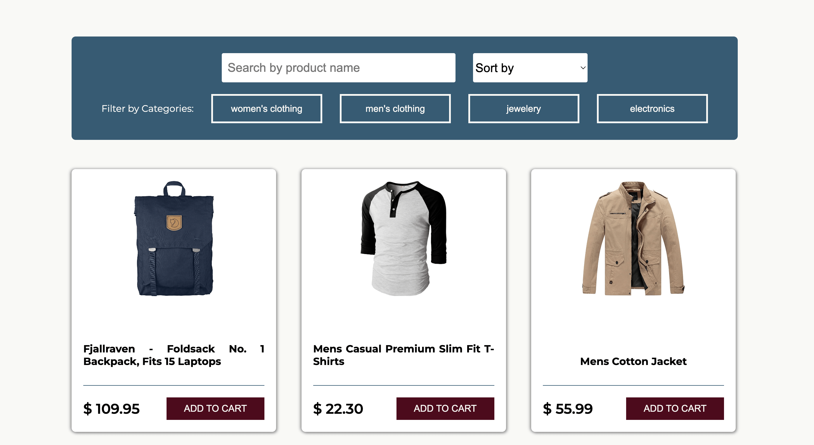

# SuperFakeStore 🛍️

In this project I coded my first API fetch.
I'm using an API from "Fake Store API" (https://fakestoreapi.com/) and a picture from unsplash.com to create a fictional online shop.

For more details about the website check ➡️ "Features"

## Have a look: 👀

💻 https://moniqueheusinger.github.io/FakeOnlineShop/

---

This project was created as part of a coding bootcamp (fullstack development) at SuperCode GmbH.

## Screenshots 📸

## Features ⭐️

- Starting with all products beeing displayed the user can filter them by category
- Any product gallery (filtered or not) can be sorted by price, too (ascending and descending)

## To do 🚧🛠️👩‍💻

- Implementing a search function (the input field is already there)
- Optimizing the JS-Code (e.g. summarize functions)
- Optimizing the design
- Adding a mobile version
- Adding a navbar --> with clickable events
  and much more hopefully... 😍

## Author 👩‍💻

[@MoniqueHeusinger](https://github.com/MoniqueHeusinger)

## Tech Stack

**Client:** HTML5, CSS3, Java Script
